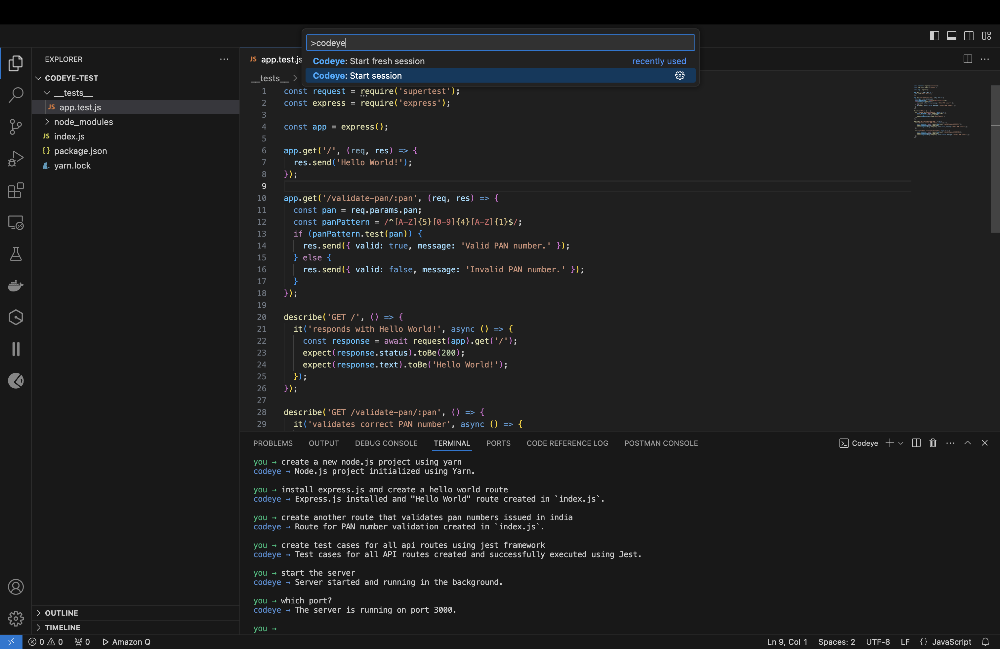
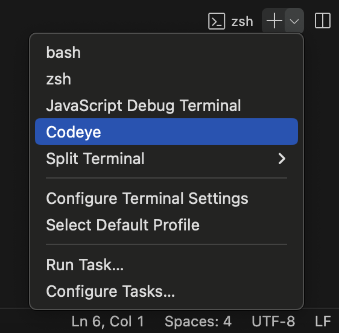
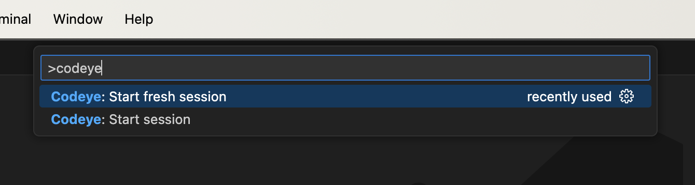

# codeye

[Visual Studio Code](https://code.visualstudio.com/) extension and CLI tool to read, fix, and write code as good as or even better than a human software engineer.

## Installation

Setting up [Codeye](https://codeye.ai/) requires you to have an [OpenAI](https://platform.openai.com/) account with some credits on it.

Then either look for **Codeye** in the **Extensions** tab and install it from there or go to [Visual Studio Marketplace](https://marketplace.visualstudio.com/items?itemName=codeye.codeye) for quick installation.

Once installed, go to **Settings** > **Extension** > **Codeye** and setup your [OpenAI](https://openai.com/) credentials there.

## Usage

There's two ways you can access the **Codeye** tool.

### Terminal

One way is to start a Codeye session from the provided terminal profile.

### Command

Or you could hit `CMD + SHIFT + P` and start a **Codeye** session from the **Command Palette**.

## Disclaimer

This is an experimental tool and currently in EAP. Your feedback is extermely valuable in shaping its future.
